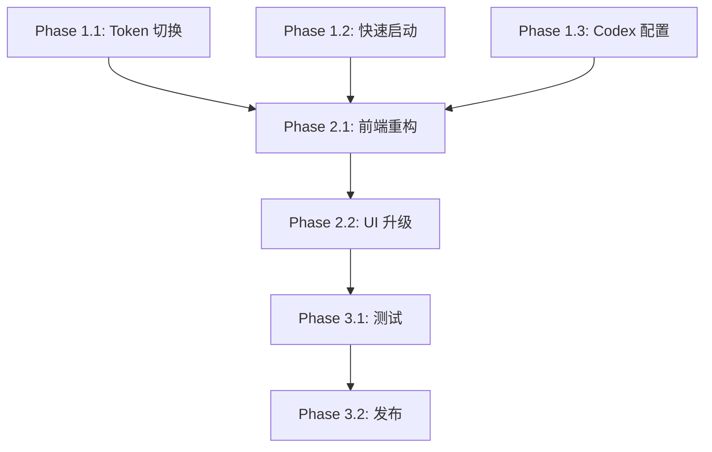

# JadeKit 项目升级路线图

## Executive Summary

JadeKit 项目第二阶段升级，新增 3 个核心功能，全面提升 UI/UX 和代码质量。

## 功能优先级

| 功能 | 优先级 | 价值 | 复杂度 | 预估工作量 |
|------|--------|------|--------|------------|
| Claude API Token 切换 | P0 | 高 | 中 | 2-3 天 |
| 快速启动（工作目录管理） | P1 | 高 | 中 | 2-3 天 |
| Codex 配置切换 | P1 | 中 | 中 | 2-3 天 |
| UI/UX 优化 | P2 | 中 | 低 | 1-2 天 |
| 前端性能优化 | P2 | 中 | 低 | 1-2 天 |
| 测试覆盖 | P3 | 中 | 中 | 2-3 天 |

## Phase 划分

### Phase 1: 核心功能实现（1-2 周）

**目标**: 实现 3 个核心新功能

#### 1.1 Claude API Token 切换 (P0)
- **后端**:
  - 创建 `models/token.rs`
  - 创建 `services/token_service.rs`
  - 注册 Tauri commands
- **前端**:
  - 创建 `types/token.ts`
  - 创建 `stores/useTokenStore.ts`
  - 创建 `pages/TokensPage.tsx`
- **测试**: 基本功能测试

**里程碑**: Token 切换功能可用

#### 1.2 快速启动功能 (P1)
- **后端**:
  - 创建 `models/workspace.rs`
  - 创建 `services/workspace_service.rs`
  - 实现终端打开功能（cmd/powershell/wt）
  - 注册 Tauri commands
- **前端**:
  - 创建 `types/workspace.ts`
  - 创建 `stores/useWorkspaceStore.ts`
  - 创建 `pages/WorkspacesPage.tsx`
- **测试**: 终端打开测试（Windows）

**里程碑**: 快速启动功能可用

#### 1.3 Codex 配置切换 (P1)
- **后端**:
  - 添加 `toml` 和 `base64` 依赖
  - 创建 `models/codex.rs`
  - 创建 `services/codex_service.rs`
  - 实现配置读写和编解码
  - 注册 Tauri commands
- **前端**:
  - 创建 `types/codex.ts`
  - 创建 `stores/useCodexStore.ts`
  - 创建 `pages/CodexPage.tsx`
- **测试**: 配置切换和备份测试

**里程碑**: Codex 配置切换功能可用

### Phase 2: 架构优化和 UI 升级（1 周）

**目标**: 改善用户体验和代码质量

#### 2.1 前端架构重构
- 提取共享组件:
  - `components/shared/PageHeader.tsx`
  - `components/shared/EmptyState.tsx`
  - `components/shared/ItemCard.tsx`
  - `components/shared/FormDialog.tsx`
- 重构重复页面（Prompts/Skills/Subagents）
- 性能优化:
  - React.lazy 懒加载
  - 代码分割
  - Zustand devtools

**里程碑**: 代码复用率提升 50%

#### 2.2 UI/UX 升级
- 优化空状态设计
- 添加加载动画和过渡效果
- 统一视觉风格
- 改进交互反馈
- 完善深色模式

**里程碑**: UI 现代化完成

#### 2.3 后端优化
- 修复 P0 bug（MCP 项目级路径）
- 统一错误处理
- 添加日志记录
- 性能优化

**里程碑**: 后端稳定性提升

### Phase 3: 测试和发布（3-5 天）

**目标**: 确保质量，准备发布

#### 3.1 测试覆盖
- 后端单元测试（Rust）
- 前端组件测试（Vitest + RTL）
- E2E 测试（Playwright）
- 手动测试关键流程

**里程碑**: 测试覆盖率 >70%

#### 3.2 文档和发布
- 用户文档
- 开发者文档
- 构建和打包
- 发布准备

**里程碑**: v2.0 发布

## 依赖关系

## 时间线

| Week | Phase | 重点工作 | 交付 |
|------|-------|----------|------|
| Week 1 | Phase 1.1 | Token 切换功能 | Token 管理页面 |
| Week 2 | Phase 1.2-1.3 | 快速启动 + Codex | 新功能完成 |
| Week 3 | Phase 2 | 架构优化 + UI | 代码质量提升 |
| Week 4 | Phase 3 | 测试 + 发布 | v2.0 Release |

## 风险管理

### 技术风险

| 风险 | 概率 | 影响 | 缓解措施 |
|------|------|------|----------|
| Tauri shell API 兼容性 | 中 | 高 | 早期测试，准备备选方案 |
| TOML 解析问题 | 低 | 中 | 使用成熟的 crate |
| 配置文件权限问题 | 中 | 中 | 添加权限检查 |

### 资源风险

| 风险 | 概率 | 影响 | 缓解措施 |
|------|------|------|----------|
| 开发时间不足 | 中 | 高 | 优先 P0/P1 功能 |
| 测试时间不足 | 高 | 中 | 自动化测试优先 |

### 质量风险

| 风险 | 概率 | 影响 | 缓解措施 |
|------|------|------|----------|
| 新功能 bug | 高 | 中 | 充分测试，分阶段发布 |
| 性能问题 | 低 | 中 | 性能监控 |

## 成功标准

### 功能完整性
- ✅ 3 个核心功能全部实现
- ✅ 所有功能正常工作
- ✅ 无 P0/P1 bug

### 代码质量
- ✅ 测试覆盖率 >70%
- ✅ 无 Rust warnings
- ✅ TypeScript 类型安全

### 用户体验
- ✅ UI 现代化
- ✅ 响应速度 <100ms
- ✅ 操作流程简洁

### 文档完整性
- ✅ 用户文档
- ✅ 开发者文档
- ✅ API 文档

## 下一步行动

1. **立即开始**: Phase 1.1 - Token 切换功能
2. **准备工作**:
   - 创建必要的目录结构
   - 安装依赖
   - 设置开发环境
3. **并行工作**:
   - 后端开发
   - 前端开发
   - 文档更新

## 长期规划

### v2.1 (未来)
- API 配置管理（完善现有骨架）
- Prompt 管理完整功能
- Skill 管理完整功能
- Subagent 管理完整功能

### v3.0 (未来)
- 多语言支持
- 插件系统
- 云同步
- 团队协作功能
